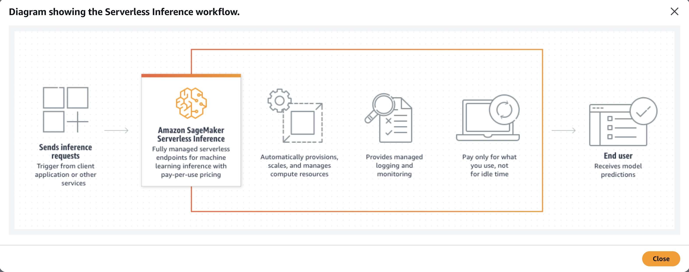

### AWS Certified Machine Learning Engineer (MLA-C01) EXAM NOTES - David Galera, July 2025

- [Amazon Managed Service for Apache Flink](#amazon-managed-service-for-apache-flink)
- [Amazon Managed Workflows for Apache Airflow](#amazon-managed-workflows-for-apache-airflow)
- [Athena](#athena)
- [Augmented AI](#augmented-ai)
- [Bedrock](#bedrock)
- [Comprehend](#comprehend)
- [Data Formats](#data-formats)
- [EMR](#emr)
- [Glue](#glue)
- [Glue DataBrew](#glue-databrew)
- [Kendra](#kendra)
- [Kinesis Data Analytics](#kinesis-data-analytics)
- [LakeFormation](#lakeformation)
- [Macie](#macie)
- [QuickSight](#quicksight)
- [Redshift](#redshift)
- [SageMaker](#sagemaker)
- [SageMaker Automatic Model Tuning (AMT)](#sagemaker-automatic-model-tuning-amt)
- [SageMaker Autopilot](#sagemaker-autopilot)
- [SageMaker Canvas](#sagemaker-canvas)
- [SageMaker Clarify](#sagemaker-clarify)
- [SageMaker DataWrangler](#sagemaker-datawrangler)
- [SageMaker Debugger](#sagemaker-debugger)
- [SageMaker Deployments](#sagemaker-deployments)
- [SageMaker Endpoints](#sagemaker-endpoints)
- [SageMaker Experiments](#sagemaker-experiments)
- [SageMaker Feature store](#sagemaker-feature-store)
- [SageMaker File Modes](#sagemaker-file-modes)
- [SageMaker Ground Truth](#sagemaker-ground-truth)
- [SageMaker Jumpstart](#sagemaker-jumpstart)
- [SageMaker Models](#sagemaker-models)
- [SageMaker Model Monitor](#sagemaker-model-monitor)
- [SageMaker Model Registry](#sagemaker-model-registry)
- [SageMaker NEO](#sagemaker-neo)
- [SageMaker Pipelines](#sagemaker-pipelines)
- [SageMaker Processing Jobs](#sagemaker-processing-jobs)
- [SageMaker Script Mode](#sagemaker-script-mode)
- [SageMaker Studio](#sagemaker-studio)
- [SageMaker TensorBoard](#sagemaker-tensorboard)
- [Step functions](#step-functions)
- [Model Interpretability](#model-interpretability)
- [Model training](#model-training)
- [Extra](#extra)

## Amazon Managed Service for Apache Flink

Amazon Managed Service for Apache Flink is a fully managed service that efficiently processes real-time data streams with low latency. It allows for seamless integration with Kinesis Data Streams and supports minute-by-minute aggregation with minimal operational effort.

## Amazon Managed Workflows for Apache Airflow

It requires significant setup and maintenance, and while it can integrate with AWS services, it does not provide the seamless, built-in integration with SageMaker that SageMaker Pipelines offers.

## Athena

- Athena can **write the filtered results back to S3 in optimized formats like Parquet or ORC**, which significantly improves query performance and reduces costs.
- Athena requires no infrastructure management, making it the most efficient and low-operational solution for querying S3-based CSV data.

## Augmented AI

Amazon Augmented AI (A2I) is a service that helps implement human review workflows for machine learning predictions. It integrates human judgment into ML workflows, allowing for reviews and corrections of model predictions, which is critical for applications requiring high accuracy and accountability.

## Bedrock

## Comprehend

Amazon Comprehend provides the ability to **locate and redact PII entities in English or Spanish text documents**. You can easily process and anonymize personal information.

## Data Formats

- `Apache ORC` (Optimized Row Columnar) is another columnar storage format that is designed for high performance and efficient storage of data. While it can be a good choice for analytical processing, `Apache Parquet` is generally preferred for its wider adoption, better performance, and support for **schema evolution in semi-structured data**.
- `Apache Parquet` is a columnar storage format optimized for analytics **well-suited for storing semi-structured data with schema evolution requirements**. It supports efficient compression, encoding, and is suitable for both batch and interactive analytics on semi-structured data. It also supports schema evolution, which allows modifications to the data structure over time. It provides efficient storage, high performance for batch and interactive analytics, and supports complex nested data structures. This makes it a suitable choice for analytical processing needs.
- `CSV`, not suited for semi-structured data with schema evolution

## EMR

Amazon EMR cluster architecture consists of the following nodes:

**Primary Node** - Manages the cluster and must always be reliable. An On-Demand instance ensures continuous operation.

**Core Nodes** - Perform data processing and store intermediate results in HDFS. These nodes must also be fault-tolerant, requiring On-Demand instances.

**Task Nodes** - Execute additional processing without storing data, making Spot instances a cost-effective choice since their loss does not affect data durability.

## Glue

AWS Glue provides serverless, scalable ETL capabilities to preprocess and transform large amounts of raw metadata from S3, enabling efficient ingestion pipelines and automatically manages Spark clusters under the hood.

You can use AWS Glue ETL jobs to define and perform transformations on your data. You can create **Python** or **Scala** scripts to perform the necessary transformations. Then, AWS Glue will manage the underlying infrastructure to run the job.

AWS Glue **does not provide ready-to-use Docker images** for popular ML frameworks such as TensorFlow and PyTorch.

**AWS Glue Data Quality** is designed to evaluate and enforce data quality rules on datasets processed through AWS Glue ETL jobs.

`AWS Glue crawlers`: can analyze the .csv files in Amazon S3 and automatically **infer the schema** and structure of the data. This creates a table definition in the AWS Glue Data Catalog, enabling the data to be organized and understood. AWS Glue crawlers are **not designed for real-time schema inference**; they are **scheduled or manually triggered**.

**job bookmarking** in AWS Glue allows the ETL jobs to track the state of the data processed between job runs, reducing redundancy by processing only the new or changed data since the last job run. This significantly enhances efficiency and cost-effectiveness without sacrificing performance.

Configure **incremental data loads in Glue ETL jobs** to ensure only newly added data is processed, thus minimizing compute resources and processing time.

## Glue DataBrew

Visual data preparation tool that can be used to clean and normalize data, handle missing values, and remove outliers efficiently. It provides a user-friendly interface for data preparation tasks without the need for complex coding.

DataBrew recipe `RESCALE_OUTLIERS_WITH_Z_SCORE`

## Kendra

Search service that uses natural language processing and advanced ML algorithms to return specific answers to search questions from your data.

## Kinesis Data Analytics

**Amazon Kinesis Data Analytics for SQL** Applications, you can process and analyze streaming data using standard SQL. The service enables you to quickly author and run powerful SQL code against streaming sources to perform time series analytics, feed real-time dashboards, and create real-time metrics.

To get started with Kinesis Data Analytics, you create a Kinesis Data Analytics application that continuously reads and processes streaming data. The service supports **ingesting data** from **Amazon Kinesis Data Streams** and **Amazon Data Firehose** streaming sources. Kinesis Data Analytics supports Amazon Data Firehose (Amazon S3, Amazon Redshift, Amazon OpenSearch Service, and Splunk), AWS Lambda, and Amazon Kinesis Data Streams as destinations.

## LakeFormation

AWS Lake Formation is specifically designed for aggregating and managing large datasets from various sources, including Amazon S3, databases, and other on-premises or cloud-based sources.

- Large-scale ETL operations
- Automate schema inference from on-premises databases

By leveraging **Lake Formation tags**, the company can assign metadata tags to datasets, such as sports, movies, or documentaries, to categorize the data based on content type. These tags can then be used to define **tag-based permissions that are mapped to the IAM roles** of analysts. This approach ensures that analysts have access only to the data relevant to their assigned categories, such as sports-related data for sports analysts.

## Macie

## QuickSight

You can use QuickSight to make predictions for a column in a model dataset.

## Redshift

**Materialized views** require periodic refreshes and consume additional storage. They are static representations and do not dynamically adapt to changing data access needs, increasing operational complexity.

**Dynamic data masking in Amazon Redshift** provides a seamless way to protect sensitive information, such as personally identifiable information (PII), while maintaining the integrity of the source data. This feature dynamically obscures sensitive columns at query time, ensuring that users without explicit permissions only see masked or obfuscated data. Unlike other approaches, dynamic data masking eliminates the need for duplicating or transforming datasets, reducing operational complexity and storage overhead.

## SageMaker

Importing models:

- Bring custom **R models** to SageMaker: "bring your own container" option, just write the Dockerfile.
- **SageMaker SDK** includes functions that you can use to **onboard existing Python models** that are written in supported frameworks.
- You must register the models in the **SageMaker model registry** before you can import the models into **SageMaker Canvas**
- SageMaker Processing jobs are designed for batch data processing rather than real-time aggregation

By default, SageMaker training and deployed inference containers are **internet-enabled**. To prevent the training and inference containers from having access to the internet, you must enable **network isolation**.

**Amazon SageMaker Warm Pools** allow reuse of ML compute infrastructure between consecutive training jobs. This significantly reduces startup times because instances remain warm and do not require new provisioning or configuration. Warm Pools work seamlessly with SageMaker training jobs, helping minimize infrastructure startup overhead while ensuring the infrastructure is reused securely and efficiently. This is ideal for use cases where consecutive training jobs are frequent, as in experimentation workflows.

Bring Your Own Container: `Script mode` enables you to write custom training and inference code while still utilizing common ML framework containers maintained by AWS.

**SageMaker shadow testing** is the most efficient and reliable solution for evaluating a new model's performance using live data without impacting production systems. In shadow testing, a copy of the live traffic is routed to the new model for predictions while the production model continues to serve end users. This setup allows the company to compare predictions from both models in real time and assess the new model’s performance under actual usage conditions.

**SageMaker domains**

## SageMaker Automatic Model Tuning (AMT)

To initiate automatic tuning in SageMaker, the engineer must provide the **dataset**, the **algorithm** to be used, and the **range of hyperparameters** to explore. A performance metric, such as accuracy or mean squared error, must be specified to evaluate the quality of different hyperparameter combinations.

Searches for the most suitable version of a model by running training jobs based on the algorithm and objective criteria. You can use a **warm start tuning job to use the results from previous training jobs as a starting point**. SageMaker can use **early stopping** to compare the current objective metric against the median of the running average of the objective metric.

- `IDENTICAL_DATA_AND_ALGORITHM` setting assumes the same input data and training image as the previous tuning jobs
- `TRANSFER_LEARNING` setting can use different input data, hyperparameter ranges, and other hyperparameter tuning job parameters than the parent tuning jobs.

## SageMaker Autopilot

Amazon SageMaker Autopilot offers **low-code** machine learning capabilities by automating the process of building, training, and tuning models while providing transparency into the model-building steps. Users provide a dataset and define the target variable, and Autopilot automatically preprocesses data, selects algorithms, and optimizes hyperparameters

It provides end-to-end automation for machine learning workflows, including data preprocessing, feature engineering, model training, and evaluation.

It evaluates multiple candidate models to determine their predictive power with minimal manual effort.

It is fully managed, making it ideal for teams looking to quickly assess a dataset's suitability for predictive modeling.

SageMaker Autopilot can automatically explore and select the best models, but it **typically aims for optimal performance rather than establishing a simple model baseline**.

## SageMaker Canvas

Currently, you can only share models to Canvas (or view shared Canvas models) in Studio Classic. And the model must be registered in SageMaker Model Registry

## SageMaker Clarify

**Not specifically designed for detecting model drift caused by changes in data distribution.**

Designed to detect bias in datasets and model predictions. It can be used to analyze how changes in data distribution affect the model's predictions. You specify input features, such as gender or age, and SageMaker Clarify runs an analysis job to detect potential bias in those features.

Provides comprehensive tools for analyzing the impact of data distribution changes on model bias and fairness. Assess impact of data shift on model performance.

Amazon SageMaker Clarify feature attribution monitoring helps data scientists and ML engineers monitor predictions for feature attribution drift on a regular basis. By tracking feature distributions over time, you can identify when a significant shift occurs, investigate its impact on model performance, and decide if retraining is necessary.

## SageMaker DataWrangler

**Sagemaker Data Wrangler cannot import from Amazon DynamoDB**. You can use Amazon SageMaker Data Wrangler to import data only from the following data sources: **SageMaker Feature store, S3, Amazon Athena, Amazon Redshift, and Snowflake**.

`balance data` operation

`corrupt image` transform is specifically designed to simulate real-world image imperfections, such as noise, blurriness, or resolution changes, during the preprocessing stage

Suited for cleaning, visualizing, and transforming datasets before training machine learning models, but it lacks the machine learning-powered deduplication features provided by `AWS Glue FindMatches`. It **does not have** built-in capabilities for detecting or grouping **duplicate records**, especially those requiring fuzzy matching.

- Minimal operational effort with a visual, interactive interface.
- Access and select your tabular and image data from various popular sources - such as Amazon Simple Storage Service (Amazon S3), on-premises databases, Amazon Athena, Amazon Redshift, AWS Lake Formation, Snowflake, and Databricks - and over 50 other third-party sources - such as Salesforce, SAP, Facebook Ads, and Google Analytics.
- Write queries for data sources using SQL and import data directly into SageMaker from various file formats, such as CSV, Parquet, JSON, and database tables.
- Provides built-in anomaly detection tools and visual insights for streamlined analysis.
- Easily exports transformed datasets to SageMaker for training.
- Provides a **data quality and insights report** that automatically verifies data quality (such as missing values, duplicate rows, and data types) and helps detect anomalies (such as outliers, class imbalance, and data leakage) in your data.
- Offers over 300 prebuilt PySpark transformations and a natural language interface to prepare tabular, timeseries, text and image data without coding
- **Quick Model** feature in Data Wrangler allows users to train a simple model quickly and visualize the **feature importance**

## SageMaker Debugger

Amazon SageMaker Debugger provides a low-effort, integrated solution to address common training issues like **vanishing gradients, GPU underutilization, and overfitting**. By enabling built-in rules, SageMaker Debugger can monitor training jobs in real time, detect issues, and automatically trigger actions such as stopping training or generating alerts. These rules offer deep insights and actionable metrics while integrating seamlessly with SageMaker Studio for visualization. Example **rules**:

- `VanishingGradient` - This rule detects if the gradients in a trial become extremely small or drop to a zero magnitude. If the mean of the absolute values of the gradients drops below a specified threshold, the rule returns True.
- `Overfit` - This rule detects if your model is being overfit to the training data by comparing the validation and training losses. This rule can be applied either to one of the supported deep learning frameworks (TensorFlow, MXNet, and PyTorch) or to the XGBoost algorithm.
- `LowGPUUtilization` - The LowGPUUtilization rule helps detect if GPU utilization is low or suffers from fluctuations. This is checked for each GPU on each worker. Rule returns True if 95th quantile is below threshold_p95 which indicates underutilization. Rule returns true if 95th quantile is above threshold_p95 and 5th quantile is below threshold_p5 which indicates fluctuations.

Helps in identifying training issues such as vanishing gradients, exploding gradients, and tensor saturation. Relevant for debugging model training processes.

## SageMaker Deployments

## SageMaker Endpoints

- Asynchronous: This option is ideal for requests with large **payload sizes (up to 1GB)**, long **processing times (up to one hour)**, and **near real-time latency** requirements. Asynchronous Inference enables you to save on costs by **autoscaling the instance count to zero when there are no requests to process**, so you only pay when your endpoint is processing requests. Designed for use cases where requests can be processed in batches and are not time-sensitive.
- Real-time: Receive responses for each request in real time, low latency or high throughput, can process responses only for **up to 60 seconds, payload size limit of 6 MB**. Real-time endpoints have a **continuous cost**, even when idle. Requires provisioning and managing infrastructure to handle traffic spikes. You can enable **data capture** and integrate it with Clarify to perform bias detection. The `min number of copies` specifies the minimum number of model copies that you want to have hosted on the endpoint at any given time.
- Serverless: Ideal for workloads which have idle periods between traffic spurts and can tolerate **cold starts**. Receive responses for each request in **real time**. Scale independently. **It can support payload sizes up to 4 MB and processing times up to 60 seconds**. Setting `MaxConcurrency` to 1 ensures the endpoint can handle one request at a time. **Memory limit 6 GB and max 200 concurrent requests**. You **cannot configure a VPC** for the endpoint in this solution. Ideal for workloads that have idle periods between traffic spikes and can tolerate cold starts. **Provisioned concurrency** allows you to deploy models on serverless endpoints with predictable performance, and high scalability by keeping your endpoints warm, useful for predictable workloads.

- Batch transform: Batch transform is a serverless, scalable, and cost-effective solution for **offline** predictions on large batches of data that is available upfront and you don’t need a persistent endpoint.

Production variants:

You can also have a **shadow variant** corresponding to a production variant behind an endpoint. A portion of the inference requests that goes to the production variant is copied to the shadow variant. The responses of the shadow variant are logged for comparison and not returned to the caller. This lets you test the performance of the shadow variant without exposing the caller to the response produced by the shadow variant.

**Data Capture** is a feature of SageMaker endpoints. You can use Data Capture to record data that you can then use for **training, debugging, and monitoring**. Data Capture runs **asynchronously without impacting production traffic**. You can use the data captured to **retrain the model**.

## SageMaker Experiments

Feature of **SageMaker Studio** that you can use to automatically create ML experiments by using different combinations of data, algorithms, and parameters. Not used to collect new data.

Organize work into Experiments, which group multiple Trials (individual training runs). Each trial is composed of Trial Components that capture different stages of the machine learning process (e.g., data preprocessing, training). Trackers are used to log the inputs (such as hyperparameters) and outputs (such as metrics) for reproducibility and traceability.

A **trial** in SageMaker Experiments represents a single run of a training job with a specific configuration, and **trial components** capture the **stages** within that trial, such as data preprocessing, model training, and evaluation.

## SageMaker Feature store

A **feature group** is a logical grouping of features, which is the foundation of the SageMaker Feature Store. It defines the schema of the data, such as feature names, types, and metadata. Creating a feature group is the **first step to structure and organize features**.

## SageMaker File Modes

If your dataset is too large for file mode, has many small files that you can't serialize easily, or uses a random read access pattern, FSx for Lustre is a good option to consider. Its file system scales to hundreds of gigabytes per second (GB/s) of throughput and millions of IOPS, which is ideal when you have many small files.

**FSx is not the optimal solution to provide low-latency access to many large video files**, you should rather use the Fast File mode for the video files in the relevant Amazon S3 bucket folder.

Create an FSx for Lustre file system linked with the Amazon S3 bucket folder having the training data for the small image files

You can then apply Fast File mode for the video files in the relevant Amazon S3 bucket folder

- **File mode** downloads training data to a local directory in a Docker container.
- **Pipe mode** streams data directly to the training algorithm.
- **Fast file mode**: **Best suited for workloads with many small files. Only available for S3 data**. Provides the benefits of both file mode and pipe mode. For example, fast file mode gives SageMaker the flexibility to access entire files in the same way as file mode. Additionally, fast file mode provides the better performance of pipe mode.

**Fast file mode** gives the model the ability to begin training before the entire dataset has finished loading. Therefore, fast file mode **decreases the startup time**. As the training progresses, **the entire dataset will load**. Therefore, you must **have enough space** within the storage capacity of the training instance.

## SageMaker Ground Truth

Amazon SageMaker Ground Truth is used for building highly accurate training datasets for machine learning quickly. It does involve human annotators for labeling data, but it is not specifically designed for monitoring or human review of model predictions in production

## SageMaker Jumpstart

With SageMaker JumpStart, you can evaluate, compare, and select FMs quickly based on pre-defined quality and responsibility metrics to perform tasks like article summarization and image generation. SageMaker JumpStart provides managed infrastructure and tools to accelerate scalable, reliable, and secure model building, training, and deployment of ML models.

You can quickly **deploy a pre-trained model and fine-tune it using your custom dataset**. This approach allows you to leverage existing **NLP models**, reducing both development time and computational resources needed for training from scratch.

## SageMaker Models

- **Random Cut Forest (RCF)**: unsupervised algorithm for detecting anomalous data points within a data set.
- **XGBoost** has built-in techniques for handling class imbalance, such as `scale_pos_weight`.
- **Linear Learner** algorithm can handle classification tasks, it is specifically designed to handle class imbalance by adjusting class weights. However, it may not be as effective in capturing complex patterns in the data as more sophisticated algorithms like XGBoost.
- **BlazingText** is designed for natural language processing tasks like text classification and word embedding

## SageMaker Model Monitor

- **Data Drift** detection: `DefaultModelMonitor` class to generate statistics and constraints around the data and to deploy a monitoring mechanism that evaluates whether data drift has occurred.
  - Definition: Data drift refers to changes in the input data distribution over time compared to the data the model was trained on.

  - Example: If the characteristics of the data (e.g., customer age, income, or location) change over time, this might indicate data drift.
- **Bias** detection: `ModelBiasMonitor` class to create a bias baseline and deploy a monitoring mechanism that evaluates whether the model bias deviates from the bias baseline.
  - Definition: Bias drift refers to changes in the model's predictions that indicate it is starting to favor certain groups or individuals unfairly over time.

  - Example: If a model begins favoring a particular demographic group (e.g., males vs. females) that wasn't evident during training, it is an example of bias drift.
- **Feature attribution** detection: use the `ModelExplainabilityMonitor` class to generate a **feature attribution baseline** and to deploy a monitoring mechanism that evaluates whether the feature attribution has occurred.
  - Definition: Feature attribution drift refers to changes in how the model weights or relies on certain features when making predictions.

  - Example: If a model starts relying heavily on a feature like "age" or "income" more than it did during training, it could indicate a shift in feature importance.
- **Quality drift** detection: `ModelQualityMonitor` Model quality monitoring jobs monitor the performance of a model by comparing the predictions that the model makes with the actual Ground Truth labels that the model attempts to predict.
  - Definition: Model quality drift refers to a decline in the model's predictive performance over time, such as lower accuracy, higher error rates, or reduced F1 scores.

  - Example: If the model starts predicting incorrectly more often, this could indicate a drift in quality.

Amazon SageMaker Model Monitor monitors the quality of Amazon SageMaker AI machine learning models in production. With Model Monitor, you can set up:

- Continuous monitoring with a real-time endpoint.
- Continuous monitoring with a batch transform job that runs regularly.
- On-schedule monitoring for asynchronous batch transform jobs.

After you deploy a model into your production environment, use Amazon SageMaker Model Monitor to continuously monitor the quality of your machine learning models in real time. Amazon SageMaker Model Monitor enables you to set up an automated alert triggering system when there are deviations in the model quality, such as data drift and anomalies. Amazon CloudWatch Logs collects log files of monitoring the model status and notifies when the quality of your model hits certain thresholds that you preset

## SageMaker Model Registry

You can use SageMaker Model Registry to create a catalog of models for production, to manage the versions of a model, to associate metadata to the model, and manage approvals and automate model deployment for CICD. **You would not use SageMaker Model Registry for model re-training**.

- **collections**: allow users to logically organize model groups into high-level categories without disrupting the integrity of the underlying model groups or artifacts. Better model management and discoverability at scale.
- Amazon SageMaker Model Registry also integrates with **AWS Resource Access Manager (AWS RAM)**, making it easier to securely share and discover machine learning (ML) models across your AWS accounts

## SageMaker NEO

After training the model in SageMaker, the data scientist can use SageMaker Neo to compile the model for the specific hardware (such as IoT or edge devices) and deploy it using AWS IoT Greengrass, ensuring optimized performance.

## SageMaker Pipelines

Visualization as a DAG - Workflows are represented as a directed acyclic graph (DAG), making it easy to visualize dependencies.

You can use **conditional steps in SageMaker Pipelines** to introduce a manual approval step before proceeding to production deployments.

A callback step allows you to integrate any task or job outside Amazon SageMaker as a step in the model building pipeline. When a callback step is invoked, the current execution of a SageMaker model building pipeline will pause and wait for an external task or job to return a task token that was generated by SageMaker at the start of call back step execution. You can use the call back step to include processing jobs external to SageMaker such a Spark job running on an **Amazon EMR** cluster or an extract-transform-load (ETL) task in **AWS Glue** as part of the SageMaker model building pipeline.

Seamless integration with **SageMaker ML Lineage Tracking** - Automatically tracks lineage information, including input datasets, model artifacts, and inference endpoints, ensuring compliance and auditability.

SageMaker Pipelines is a **workflow orchestration service** within SageMaker. Supports versioning, lineage tracking, and automatic execution of workflows, making it the ideal choice for managing end-to-end ML workflows in AWS. It allows users to define end-to-end ML workflows, including steps for data preprocessing, model training, and model evaluation, making it an ideal choice for automating the ML process in response to new data. SageMaker Pipelines supports the use of **batch transforms** to run inference of entire datasets.

**Batch transforms are the most cost-effective inference method** for models that are called only on a periodic basis. Can be triggered by **EventBridge**.

SageMaker Pipelines are designed to allow for the reusability of steps across different models and pipelines.

## SageMaker Processing Jobs

You can run the custom code on data that is uploaded to Amazon S3. SageMaker processing jobs **provide ready-to-use Docker images** for popular ML frameworks and tools.

SageMaker offers **built-in support** for various frameworks including TensorFlow, PyTorch, scikit-learn, XGBoost, and more.

## SageMaker Script Mode

SageMaker supports most of the popular ML frameworks through pre-built containers, and has taken the extra step to optimize them to work especially well on AWS compute and network infrastructure in order to achieve near-linear scaling efficiency. These pre-built containers also provide some additional Python packages, such as Pandas and NumPy, so you can write your own code for training an algorithm. These frameworks also allow you to install any Python package hosted on PyPi by including a requirements.txt file with your training code or to include your own code directories.

Write a Python script that leverages the TensorFlow framework (following the Estimator API or a custom training loop). Upload this script to S3, and specify the TensorFlow framework version in SageMaker’s built-in container. SageMaker will then run your script in the managed environment, handling tasks like data loading and distributed training.

## SageMaker Studio

SageMaker Studio Classic is excellent for ML workflows. It is designed for larger-scale, integrated workflows with multiple notebooks and users. It is not designed for large-scale ETL tasks, where AWS Glue provides a better solution.

Amazon SageMaker Studio provides a **built-in SQL extension**. This extension allows data scientists to perform tasks such as sampling, exploratory analysis, and feature engineering directly within the JupyterLab notebooks.

The integration between **Amazon EMR** and **Amazon SageMaker Studio** provides a scalable environment for large-scale data preparation for machine learning using open-source frameworks such as Apache Spark, Apache Hive, or Presto. Users can access Amazon EMR clusters and data directly from their Studio notebooks to perform their preparation tasks.

## SageMaker TensorBoard

Capability of SageMaker that you can use to visualize and analyze intermediate tensors during model training. SageMaker with TensorBoard provides full visibility into the model training process, including debugging and model optimization. You can analyze the intermediate activations and gradients during training

## Step functions

It is more general-purpose and **lacks some of the ML-specific features**, such as **model lineage tracking** and **hyperparameter tuning**, that are built into SageMaker Pipelines.

## Model Interpretability

- Partial dependence plots (PDP): Identify the difference in the predicted outcome as an input feature changes.
- Shapley values: **Feature attribution**. Quantify the contribution of each feature in a prediction.
- Difference in proportions of labels (DPL): DPL is a metric that you can use to **detect pre-training bias**. You can use DPL to avoid ML models that could potentially be biased or discriminatory.

## Model training

In **bagging**, data scientists improve the accuracy of weak learners by training several of them at once on multiple datasets. In contrast, boosting trains weak learners one after another.

**Stacking** involves training a meta-model on the predictions of several base models. This approach can significantly improve performance because the meta-model learns to leverage the strengths of each base model while compensating for their weaknesses.

**Ensemble**: typically does not capture the complex interactions between models as effectively as stacking.

**Model pruning** can significantly reduce model size without sacrificing accuracy.

**Hyperband** is a multi-fidelity based tuning strategy that dynamically reallocates resources. Hyperband uses both intermediate and final results of training jobs to re-allocate epochs to well-utilized hyperparameter configurations and automatically stops those that underperform. It also seamlessly scales to using many parallel training jobs. **These features can significantly speed up hyperparameter tuning over random search and Bayesian optimization strategies.**

By allocating fewer resources to underperforming configurations, Hyperband reduces the total computation time compared to exhaustive methods like grid search.

## Extra

- Lexical search: Compares the words in a search query to the words in documents, matching word for word
- XGBoost `pos_weight`: helps address any bias in the dataset
- ROC-AUC: Useful metric for evaluating model performance across different thresholds
- F1 Score is the harmonic mean of `precision` and `recall`
- Lowering learning rate -> **reduces the variance in the gradients**, which prevents oscillations in the training accuracy
- Vanishing gradients: model-specific issue related to learning dynamics -> adjust learning rate
- Dropout: Prevents neurons adapting to much to specific features, forcing the network to learn more robust features -> Stabilizing the training process
- L1: Adding a penalty proportional to the absolute value of the weights, encourages **sparsity**.
- Batch normalization: Stabilize the learning process by normalizing inputs to each layer
- Remove duplicates -> `AWS Glue FindMatches`:
  - Minimal coding required - The ML-based approach simplifies the deduplication process.
  - Flexible matching logic - Automatically identifies fuzzy matches and near-duplicates.
  - Scalable and serverless - Works seamlessly with large datasets in Amazon S3.
- High scalable and flexible deployment of model e.g. genAI models: `EKS`
- `AWS::SageMaker::Model` CloudFormation resource is specifically designed to define an ML model hosted on Amazon SageMaker, you define:
  - Model artifacts - Stored in Amazon S3.
  - Inference container - The container image that contains the inference code.
  - IAM Role - Permissions to allow SageMaker to access the resources required for hosting.
- `AWS::SageMaker::Endpoint` is required to host the model, it depends on a model resource (AWS::SageMaker::Model). It cannot directly define the model or its configuration
- `AWS::SageMaker::EndpointConfig` resource specifies how an endpoint is configured (e.g., instance type and count)
- **Kinesis Data Firehose** provides configurable buffer intervals for data delivery to destinations. You can create a buffering hint by setting a value of zero for `IntervalInSeconds` parameter
- **BIAS detection**: Check whether the model gives different demographic groups similar true positive rates, making it a key measure for detecting bias and ensuring fairness in sensitive applications like loan approvals. **Comparing feature distributions across demographic groups does not directly address potential bias in model predictions**.
- Bias/Variance tradeoff: The bias versus variance trade-off in machine learning is about finding a balance between bias (error due to overly simplistic assumptions in the model, leading to underfitting) and variance (error due to the model being too sensitive to small fluctuations in the training data, leading to overfitting). The goal is to achieve a model that generalizes well to new data.
- **SageMaker’s Model Parallelism Library** simplifies the process by automatically splitting the model across multiple GPUs or machines based on the architecture and memory constraints, making it easy to handle large models without manual intervention.
- **Hyperband** dynamically allocates more resources to promising hyperparameter configurations while early-stopping underperforming ones, balancing exploration and exploitation of different configurations.
